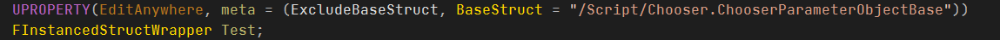
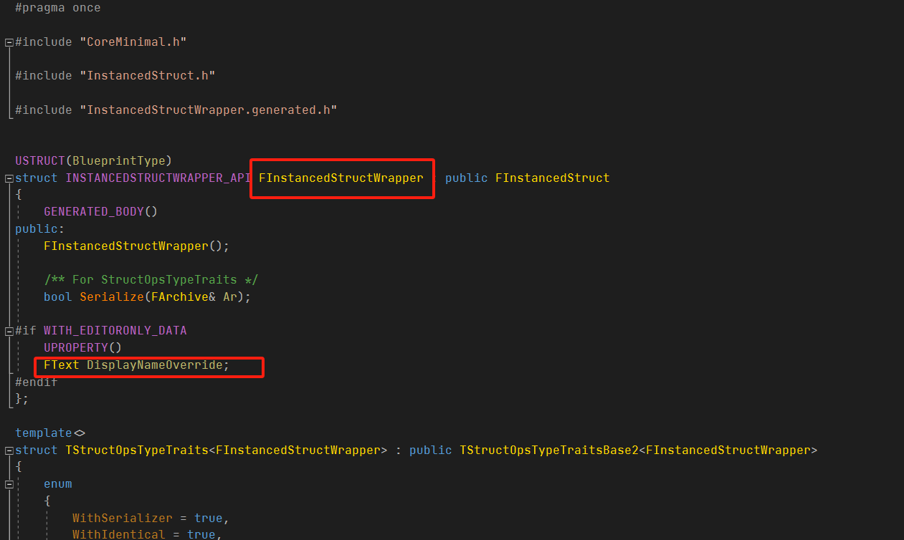
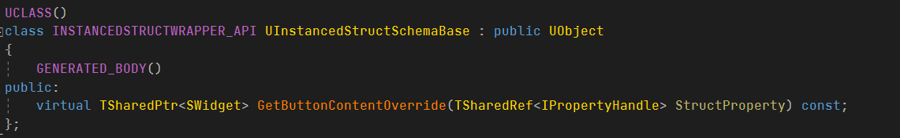
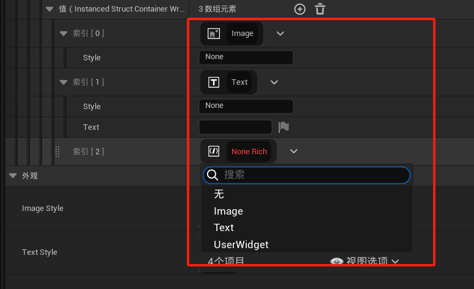
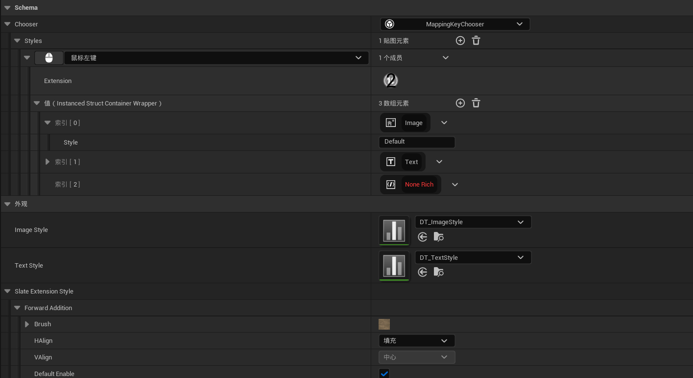

## 支持重命名

* 

* 和FInstancedStruct一样的用法

* 

* FInstancedStructWrapper结构类型

* 

* * *

## 支持内容颜色的自定义

* 

* 效果预览，仅FontColor="CD950CFF"

* 

* * *

## 支持FInstancedStructWrapper的Widget和Extension自定义
* Slate扩展：“支持覆盖原有的Button内容”、“支持在顶部及右侧添加扩展内容”
* 

* 

* 

* * *

## 提供FInstancedStructContainer的编辑器支持

* 

* * *

## （使用示例）提供自定义规则的富文本Decorator

* 可以任意叠加控件
* 可以定制自己的数据结构
* 可以预览结果
* 提供富文本的前向渲染和延迟渲染，分别支持在富文本后面和前面加内容。（可以被用于添加删除线和背景）
* 

