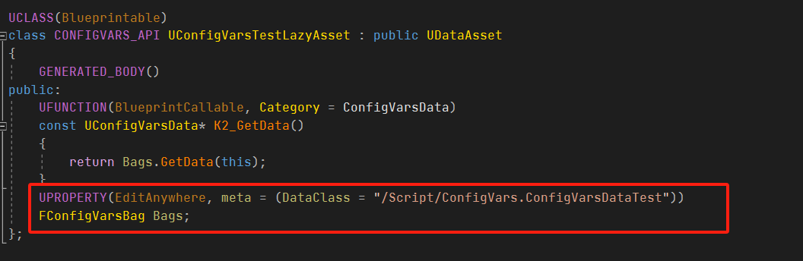
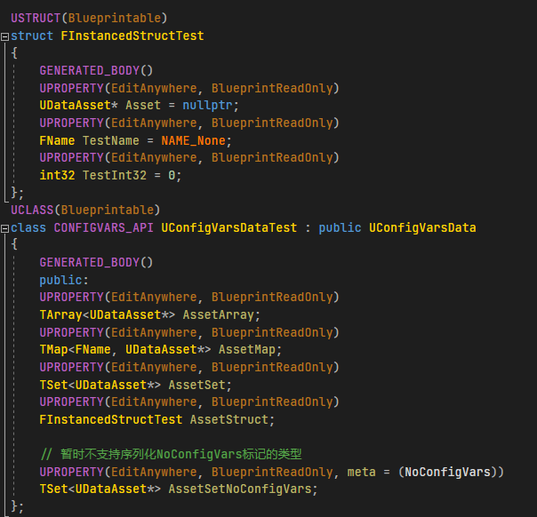
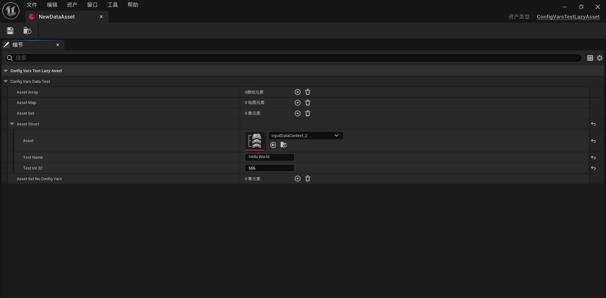
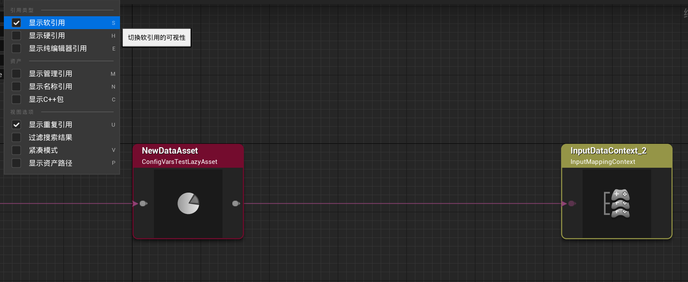

# 目录
- [功能](#功能)
  - [支持重命名](#支持重命名)
  - [支持内容颜色的自定义](#支持内容颜色的自定义)
  - [提供FInstancedStructContainer的编辑器支持](#提供FInstancedStructContainer的编辑器支持)
  - [支持FInstancedStructWrapper的Widget和Extension自定义](#支持FInstancedStructWrapper的Widget和Extension自定义)
- [项目示例](#项目示例)
  - [自定义样式组合规则的富文本Decorator](#自定义样式组合规则的富文本Decorator)
- [数据懒加载框架](#数据懒加载框架)
  - [介绍](#介绍)
  - [配置方式](#配置方式)
  - [静态数据类型配置](#静态数据类型配置)
  - [示例](#示例)
  - [适用场景](#适用场景)
- [开发方向](#开发方向)

# 功能
## 支持重命名

* 

* 和FInstancedStruct一样的用法

* 

* FInstancedStructWrapper结构类型

* 

* * *

## 支持内容颜色的自定义

* 

* 效果预览，仅FontColor="CD950CFF"

* 

* * *

## 提供FInstancedStructContainer的编辑器支持
* 

* * *

## 支持FInstancedStructWrapper的Widget和Extension自定义
* 提供了简便的Slate扩展接口：“支持覆盖原有的Button内容”、“支持在顶部及右侧添加扩展内容”。
* **FInstancedStructContainer**也适用
* 
* 
* 

* * *
# 项目示例
## 提供自定义样式组合规则的富文本Decorator

* 可以**任意叠加控件**
* 可以定制自己的数据结构
* 可以**预览**结果
* 支持改变原有富文本的垂直分布方式
* 提供富文本的**前向渲染**和**延迟渲染**方案，分别支持在富文本背面和正面舔加或覆盖内容。（可以被用于实现删除线、背景、开头和换行标记等）
	* 目前提供了两种渲染器：多行渲染和行开头占位渲染。两个渲染器都**不影响原有富文本的合批渲染**。
	* 支持自定义渲染器，但需要合理实现Supports()函数来安排渲染时期。（仅在'最'前向和'最'延迟时不会影响合批），可以参考FSchemaSlateAdditionRenderer_Brush_MultiLine（多行渲染） 和 FSchemaSlateAdditionRenderer_HeadPlaceholder_MultiLine（行开头占位渲染）。
	* 支持**动态和静态开关**，支持**动态参数**。
* 
* 

* * *
## 数据懒加载框架
### 介绍
* 直译为：配置变量。
* **完美支持**UE的三套资源加载机制：**非EDL**（Editor），**EDL**（Runtime）和**ZenLoader**（Runtime需要分Chunk）
* **原理**是在**同步加载**层面上进行了优化：**资源拆分** + **懒加载**。
* **为什么这样优化**：首先加载的最底层有IO线程队列，用来负责IO加载和序列化，一般IO耗时不大但是序列化耗时较大，(比如UE的序列化部分就没使用多个线程，20%的流程耗时了80%的时间)。且在反序列化时，我们还需要将所有硬引用的资产全部给加载，更加剧了加载的开销。

### 配置方式
* 与FInstancedStruct一样的配置方式。
* 不同的是，**DataClass**的指向是**明确的**，它需要明确指向某个数据类型。（这里主要考虑到了尽量在编辑器中能让策划能**无感配置**）
* 如果要非明确指向，请考虑结合FInstancedStructWrapper。
* 

### 静态数据类型配置
* **静态数据类**。（静态数据类中的所有UObejct硬引用都会自动懒加载）
* 类型必须继承于**UConfigVarsData**
* 支持给属性成员添加**NoConfigVars**元标记，它将不进行懒加载序列化。（目前不支持自定义序列化，麻麻的）
* 
### 示例
* 所谓的在编辑器中**无感配置**，就如下图示例所示。
* 虽然我们在上图所示的UConfigVarsTestLazyAsset中只配置了一个属性，但是我们提供了明确的数据类型指向，所以对于策划来说和常规配置流程一模一样。
* 
* 

### 适用场景
* 样式表、配置表
* 可配置表达式，例如Niagara的表达式嵌套。（在未实际执行前，我们不会反序列化任何复杂的表达式嵌套内容）

* * *
# 开发方向
## 待优化
* 目前InstancedStructContainer的编辑器支持方案不是很合理，在数据变化时，都会重新构建InstancedStructContainer，存在不必要的开销。
* （富文本拓展）修复文本内容偏移后，剪裁位置没有跟随改变的问题。
* ConfigVars框架也有支持异步加载的需要。
* ConfigVars在设计上应该只适合静态数据，但现在也可以被动态修改，这还是我设计的本意吗？
