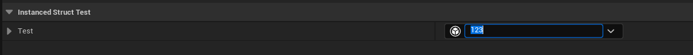
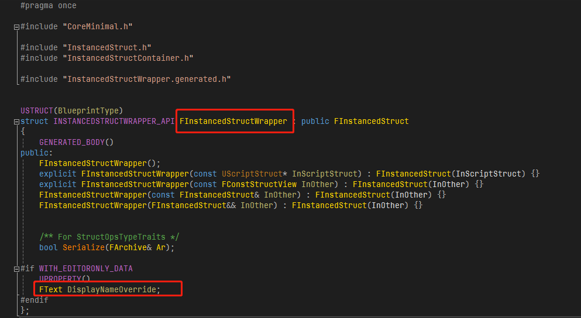
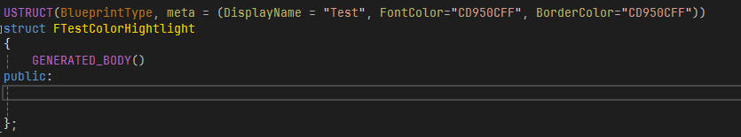
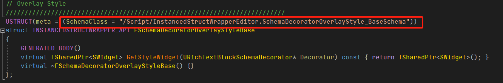
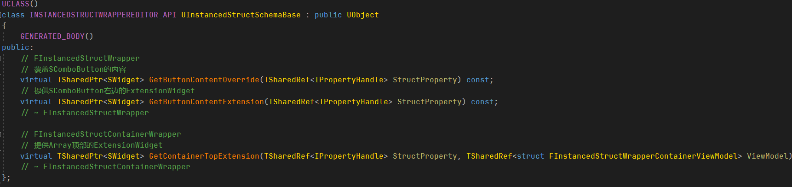
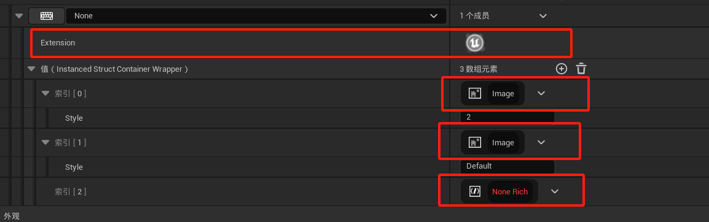
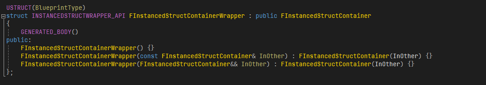
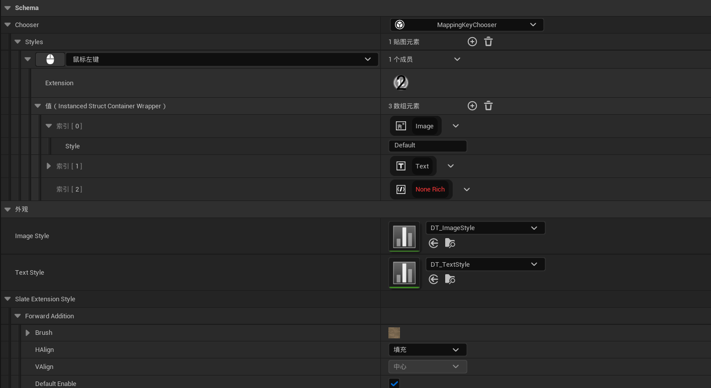
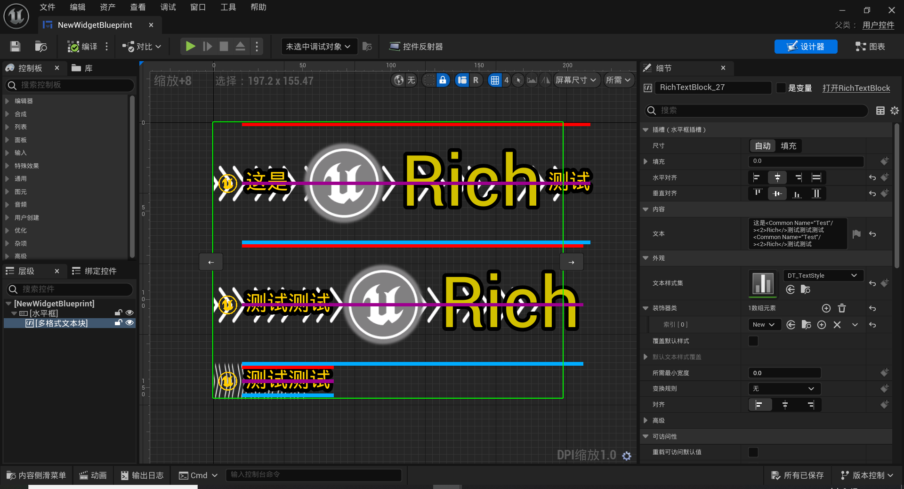

## 支持重命名

* 

* 和FInstancedStruct一样的用法

* 

* FInstancedStructWrapper结构类型

* 

* * *

## 支持内容颜色的自定义

* 

* 效果预览，仅FontColor="CD950CFF"

* 

* * *

## 支持FInstancedStructWrapper的Widget和Extension自定义
* Slate扩展：“支持覆盖原有的Button内容”、“支持在顶部及右侧添加扩展内容”
* 

* 

* 

* * *

## 提供FInstancedStructContainer的编辑器支持

* 

* * *

## （使用示例）提供自定义规则的富文本Decorator

* 可以**任意叠加控件**
* 可以定制自己的数据结构
* 可以**预览**结果
* 支持改变原有富文本的垂直分布方式
* 提供富文本的**前向渲染**和**延迟渲染**方案，分别支持在富文本背面和正面舔加或覆盖内容。（可以被用于实现删除线、背景、开头和换行标记等）
	* 目前提供了两种渲染器：多行渲染和行开头占位渲染。两个渲染器都**不影响原有富文本的合批渲染**。
	* 支持自定义渲染器，但需要合理实现Supports()函数来安排渲染时期。（仅在'最'前向和'最'延迟时不会影响合批），可以参考FSchemaSlateAdditionRenderer_Brush_MultiLine（多行渲染） 和 FSchemaSlateAdditionRenderer_HeadPlaceholder_MultiLine（行开头占位渲染）。
	* 支持**动态和静态开关**，支持**动态参数**。
* 
* 
* * *
## 待优化
* 目前InstancedStructContainer的编辑器支持方案不是很合理，在数据变化时，都会重新构建InstancedStructContainer，存在不必要的开销。
